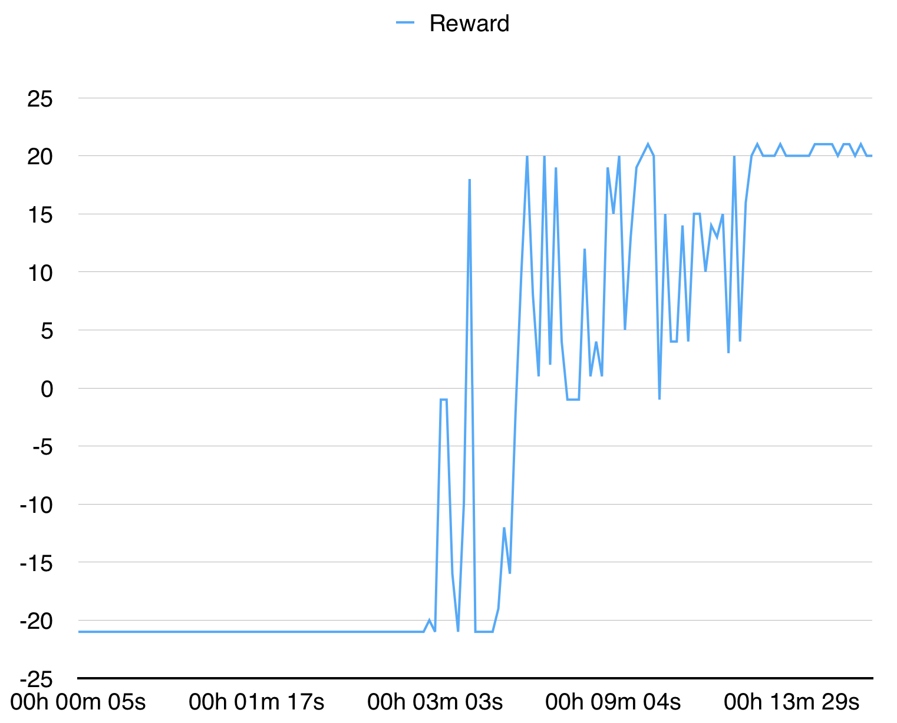

# pytorch-a3c test 
We used the repo of the below reference just to see that it works for ourselves. And to verify the scores claimed by the author below. Full credit to the original author.
Note(We kept the readme file as it is below) 

    @misc{pytorchaaac,
      author = {Kostrikov, Ilya},
      title = {PyTorch Implementations of Asynchronous Advantage Actor Critic},
      year = {2018},
      publisher = {GitHub},
      journal = {GitHub repository},
      howpublished = {\url{https://github.com/ikostrikov/pytorch-a3c}},
    }

This is a PyTorch implementation of Asynchronous Advantage Actor Critic (A3C) from ["Asynchronous Methods for Deep Reinforcement Learning"](https://arxiv.org/pdf/1602.01783v1.pdf).

This implementation is inspired by [Universe Starter Agent](https://github.com/openai/universe-starter-agent).
In contrast to the starter agent, it uses an optimizer with shared statistics as in the original paper.

## A2C

I **highly recommend** to check a sychronous version and other algorithms: [pytorch-a2c-ppo-acktr](https://github.com/ikostrikov/pytorch-a2c-ppo-acktr).

In my experience, A2C works better than A3C and ACKTR is better than both of them. Moreover, PPO is a great algorithm for continuous control. Thus, I recommend to try A2C/PPO/ACKTR first and use A3C only if you need it specifically for some reasons.

Also read [OpenAI blog](https://blog.openai.com/baselines-acktr-a2c/) for more information.


## Usage
```bash
# Works only wih Python 3.
python3 main.py --env-name "PongDeterministic-v4" --num-processes 16
```

This code runs evaluation in a separate thread in addition to 16 processes.

## Results

With 16 processes it converges for PongDeterministic-v4 in 15 minutes.


For BreakoutDeterministic-v4 it takes more than several hours.

This test was ran locally by Sulaiman Aljanahi and Naif Alkhunaizi. 
